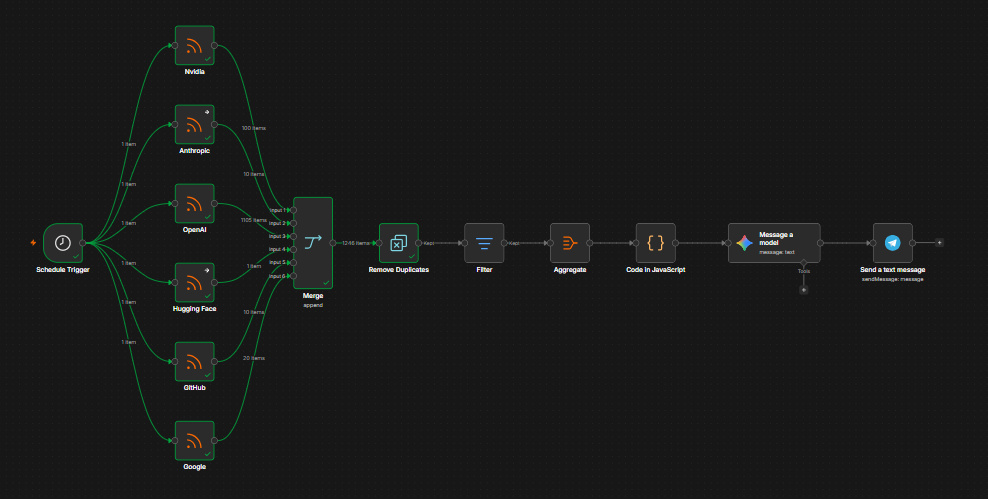

# AI News Digest — n8n Workflow

<p align="center">
  
  
  
  
  
</p>

Automated daily pipeline that pulls AI news from 6 sources, filters for relevance, has an LLM rank + summarize the most important stories, and sends a digest to Telegram every morning. Built entirely on free tiers.

## Goal
Get the **top, genuinely important** AI news each morning — not other nieches and not the same story repeated day after day.

## Workflow



## Architecture

```
Schedule Trigger (daily, morning)
     │
     ▼
RSS Read × 6 
  - OpenAI Blog        (official feed)
  - Google AI Blog     (official feed)
  - GitHub Blog        (official feed)
  - NVIDIA Developer   (official feed)
  - Anthropic          (RSSHub mirror — see notes)
  - Hugging Face       (Daily Papers feed — see notes)
     │
     ▼
Merge (append mode)
     │
     ▼
Remove Duplicates ("Remove Items Seen Before" mode, keyed on `link`)
     │
     ▼
Filter (regex on title + contentSnippet for AI relevance)
     │
     ▼
Aggregate (Individual Fields: title, link, contentSnippet)
     │
     ▼
Code node (build readable article-list text block, handle missing snippets)
     │
     ▼
Google Gemini (gemini-2.0-flash) — ranks importance, summarizes, formats digest
     │
     ▼
Telegram — Send Message (Parse Mode: Markdown)
```

## Getting started

### Prerequisites
- A free [n8n](https://n8n.io) instance (self-hosted or n8n Cloud)
- A free [Google AI Studio](https://aistudio.google.com) API key (for Gemini)
- A Telegram bot token + chat ID (create one via [@BotFather](https://t.me/BotFather))

### Setup
1. Clone or download this repo
2. In n8n, go to **Workflows → Import from File** and select `workflow.json`
3. Add your credentials:
   - **Google Gemini** node → paste your API key
   - **Telegram** node → paste your bot token and chat ID
4. Adjust the **Schedule Trigger** to your preferred time
5. Run it once manually to confirm everything connects, then activate it

### Customizing
- **Add or remove sources:** duplicate an RSS Read node, point it at a new feed URL, connect it into the Merge node
- **Adjust what counts as "AI-relevant":** edit the keyword list in the Filter node
- **Change how many stories get picked:** edit the prompt in the Gemini node ("select 5-8 most important stories")

## Cost

$0/month — built entirely on free tiers (n8n self-hosted, Gemini free tier, Telegram Bot API, free/community RSS feeds).

## Notes on data sources

A couple of sources needed workarounds since they don't offer clean, content-rich official RSS feeds:
- **Anthropic** has no official RSS feed, so this uses a community-maintained mirror
- **Hugging Face's** official blog feed has no article summaries, so this uses their community "Daily Papers" feed instead, which arguably surfaces more genuinely important content anyway

Full reasoning behind these and other build decisions is documented in [`DECISIONS.md`](./DECISIONS.md), for anyone forking this and wondering "why is this node configured this way?"
